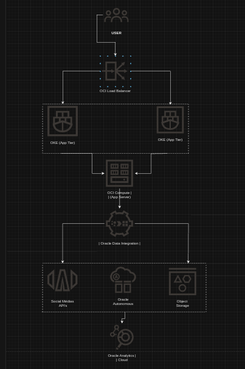

## Solution

**Migration Steps Summary**

*Assumptions*
We assume that the database is Oracle database, to facilitate migration.
That this application is found locally.
That despite the dependencies mapped in the project, we will treat the migration as without local dependencies.

*Initial Assessment*
1 - Resource Inventory: List servers, databases, applications, network and dependency.
2 - Bottleneck Identification: Identify performance and load issues.
3 - List all workloadns move fist cloud and other jobs will remain in local

*Migration Planning*
1 - OCI Services Selection: Compute, Autonomous Database, Object Storage, Load Balancer, VCN, Data Integration.
2 - Architecture Definition: Structure the solution in OCI.
3 - Set the guardrail.
4 - Define migration phases and those responsible for each project execution

*Implementation*
1- OCI Environment Configuration: Create VCN, subnets, and security rules.
Database Migration: Export/import with Data Pump, synchronization with GoldenGate.
Application Migration: Containerization with Docker, deploy on OKE.
Load Balancing Configuration: Implement OCI Load Balancer.
Oracle Data Integration Configuration: Data collection, transformation, and integration.

*Operation and Monitoring*
Continuous Monitoring: Use Oracle Cloud Monitoring and alerts.
Auto Scaling: Configure auto scaling.
Backup and Recovery: Implement backups and DRP.
**Documentation and Training*
Architecture and Operations Documentation.
IT Team Training.
*Post-Migration Review**
Performance Analysis and Adjustments.
Feedback Collection and Improvement Planning.

**Architecture Solution Design**

*Network Infrastructure*
* VCN (Virtual Cloud Network): Create a virtual network with public and private subnets.
* Security Lists and NSGs (Network Security Groups): Security rules for traffic control.
*Compute and Application*
* OCI Compute Instances: Virtual machine instances for various functions.
* Oracle Kubernetes Engine (OKE): Container orchestration for the application.

*Database*
* Oracle Autonomous Database: Migrate the database to a managed, scalable, and secure solution.

*Load Balancing*
* OCI Load Balancer: Distribute traffic among application instances for high availability.

**Data Integration**

*Oracle Data Integration*:
* Data Source Connection: Social media APIs, existing database.
* Ingestion Pipelines: Automated processes for data collection.
* ETL (Extract, Transform, Load): Data transformations and loading to appropriate destinations.
* Data Destination: Storage in Oracle Autonomous Data Warehouse and Oracle Object Storage.

*Analysis and Visualization*
* Oracle Analytics Cloud: Connect to Data Integration for creating interactive dashboards and reports.

*Monitoring and Management*
* Oracle Cloud Monitoring: Tools to monitor the performance and health of solution components.
* Alerts and Logs: Configure alerts for quick responses to issues.

**Architecture Solution Diagram**

**Diagram Description**

* End Users: Access the application through the Load Balancer.
* OCI Load Balancer: Distributes traffic among multiple application instances.
* OKE (App Tier): Container orchestration for the application.
* OCI Compute (App Server): Virtual machine instances for the application server.
* Oracle Data Integration: Integration, collection, and transformation of data from social media APIs and existing database.
* Oracle Autonomous Database: Managed database for data storage and analysis.
* Oracle Object Storage: Storage for unstructured data and backups.
* Oracle Analytics Cloud: BI tool for data analysis and visualization.

This solution offers a scalable, robust, and efficient architecture for migrating your survey application to OCI, integrating data from various sources, and providing a reliable and secure platform for continuous operations.
